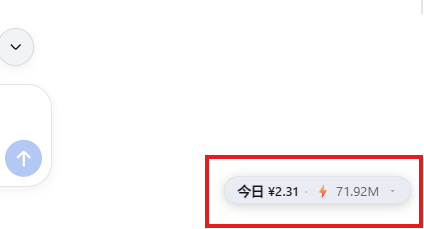
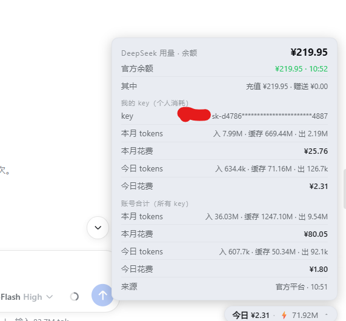

# dsh-deepseek-meter 余额与tokens用量统计

[](https://github.com/deepseek-ai/deepseek-harness)

**DSH (DeepSeek Harness) 插件** — DeepSeek 官方用量·余额可折叠胶囊。Cordis 双端插件(host 拉取官方数据 + client 渲染胶囊),安装方式:`dsh plugin add dsh-deepseek-meter`。

## 界面预览

**折叠态**(右下角胶囊,显示我的 key 今日花费 + 今日 tokens):



**展开态**(点击胶囊,显示官方余额 / 我的 key / 账号合计):



## 特性

- 折叠态:我的 key(个人)今日花费 + 今日 tokens
- 展开态:官方余额(含充值/赠送拆分)、我的 key 本月/今日 tokens 与花费、账号合计(所有 key)本月/今日
- 全部数据来自 DeepSeek 官方接口,无本地统计

## 数据源

| 数据 | 接口 | 鉴权 | 刷新 |
|---|---|---|---|
| 官方余额 | `GET api.deepseek.com/user/balance` | API key | 60s |
| 我的 key 用量 | `platform.deepseek.com/api/v0/usage/by_api_key/*` | 平台 userToken | 120s |
| 账号合计用量 | `platform.deepseek.com/api/v0/usage/*` | 平台 userToken | 120s |

> ⚠️ **私有接口风险**:`platform.deepseek.com/api/v0/usage/*` 是官方**未公开**的私有端点(供官方前端使用),需要平台网页登录的 `userToken`。官方可能随时调整或封禁,若接口变动本插件对应功能会降级显示,余额功能不受影响。

## 安装

### 从 GitHub

```sh
dsh plugin --profile <name> add github:<you>/dsh-deepseek-meter
```

git 安装运行包的 `prepare` 构建脚本,pnpm ≥10 首次安装需要在 profile 的 `pnpm-workspace.yaml` 允许构建:

```yaml
allowBuilds:
  dsh-deepseek-meter: true
```

> 该许可意味着允许包的代码在安装时于你机器上执行,仅对信任的包开启,并建议锁定 commit(`github:<you>/dsh-deepseek-meter#<sha>`)。

### 从 npm / tarball

```sh
dsh plugin --profile <name> add dsh-deepseek-meter
# 或
dsh plugin --profile <name> add ./dsh-deepseek-meter-0.1.0.tgz
```

## 配置

| 配置项 | 默认 | 说明 |
|---|---|---|
| `balanceUrl` | `https://api.deepseek.com/user/balance` | 官方余额接口 |
| `platformBase` | `https://platform.deepseek.com/api/v0` | 平台私有用量接口前缀 |
| `balanceIntervalMs` | `60000` | 余额刷新间隔 |
| `usageIntervalMs` | `120000` | 用量刷新间隔 |
| `uiPollMs` | `2000` | 前端轮询间隔 |
| `fetchTimeoutMs` | `20000` | 子进程请求超时 |

> 配置字段类型须按表填写(字符串/数字)。类型错误会导致插件**加载失败**(行失效,不会使 dsh 崩溃)——修改配置并重启即可恢复。

## 与动态版插件共存

- 本插件的胶囊使用专属 id `dsh-deepseek-meter-pill`,与旧动态版(`umcap-*`,id `usage-meter-badge`)**不会冲突**。
- 但若旧动态版仍在运行,页面会**同时出现两个胶囊**(数据相同)。停用动态版即可:在会话中 `cordis_stop umcap-<id>`,或等 dsh 重启后动态定义自动消失。

## 凭据

插件的代码中**不包含任何密钥**。运行前请确保 DSH 凭据中已配置:

| 凭据 | 用途 | 获取 |
|---|---|---|
| `DEEPSEEK_API_KEY` | 查询余额、识别"我的 key" | DeepSeek 开放平台 |
| `DEEPSEEK_PLATFORM_TOKEN` | 查询用量(平台 userToken) | 平台网页登录后从 localStorage 的 `userToken.value` 复制 |

> `DEEPSEEK_PLATFORM_TOKEN` 相当于平台网页登录凭证,请像密码一样保管;泄露后到平台退出登录即可使其失效。

## 架构与 RPC 通道

- **host 半**:`lib/index.js`(ESM 标准 Cordis 插件,`dsh.bundle` 配置层),拉取官方数据,通过 `ctx.webServer.register()` 注册 `/api/deepseek-meter/state` HTTP 路由暴露状态。
- **client 半**:`lib/client.js`(CJS,`window.__ModuleLoader__.load` 契约,`dsh.client` 声明),右下角胶囊 UI 每 2s 轮询该路由。

> **为何不用官方 Typert Remote**:DSH 官方静态双端插件的标准 client→host 通道是 Typert Remote(`@deepseek-ai/dsh-typert-generator` 已发布到 npm,理论可行),但该路径在仓库内无第三方先例、需要 typertPlugin 构建链 + client `$mount` 自挂载,风险未验证。本插件 v0.1.0 采用 `webServer` HTTP 路由:公开 API、独立可构建、同源无 CORS,功能等价。**升级到 Typert Remote 的迁移路径**:host 半改为 `TypertRemoteService` 子类 + `@Remote('state')`,package.json 导出 `./typert`/`./remote`,client 半 `ctx.remote.$mount` 后 `ctx.remote.<ns>.state()` 直调。若 DSH 后续版本调整 `webServer` API,可借此路径迁移。

## 许可证

MIT
